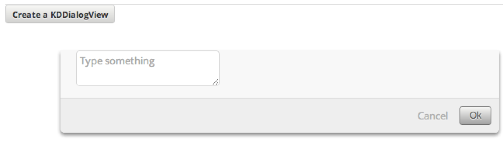

# KDDialogView

KDDialogView is inerhited from [KDView](/framework/input/KDView).
It let you easily create on-the-fly dialogs. Below is example code.

    :::coffeescript
    @button = new KDButtonView
      title      : "Create a KDDialogView"
      callback   : =>
        @dialog.show()

    @dialog = new KDDialogView
      duration    : 200
      topOffset   : 100
      overlay     : yes
      height      : "auto"
      buttons     :
        Ok      :
          style   : "modal-clean-gray"
          callback: () =>
            new KDNotificationView
              content : @form.getValue()
        Cancel    :
          style   : "modal-cancel"
          callback: () =>
            new KDNotificationView
              content : "Hiding KDDialogView"
            @dialog.hide()

    @dialog.addSubView @wrapper = new KDView
      cssClass : "kddialog-wrapper"

    @wrapper.addSubView @form = new KDInputView
      type          : "textarea"
      placeholder   : "Type something"

If you click on the button, a dialog will slide from top to bottom:

The currently supported options are:

* **duration** : a Number. By default it is 200. After 200 msec the dialog slides
down.
* **topOffset**: a Number. By default it is 0. Describes the upper padding of the
app. It's mimicing the dialog window from Mac OSX like Os's. In our example we
choose 100, otherwise it would overlay the button.
* **overlay**: a Boolean. By defaul it is yes. Means if you click anywhere except
the dialog itself, than the dialog view get closed. This is the recommended way
to use.
* **buttons**: list of [KDButtonView](/framework/buttons/KDButtonView). By default
it has a KDButtonView with the name "Cancel" that when clicked hides the dialog
view. You can override it (as we have done above)

