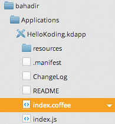

First Steps
===========

Creating a Koding Application is easy. All you need is inside Koding
development environment. Suprised? :)

First, right click your Applications directory and click **Make a new
Application**.

This will open a dialog and let you select a template and name for your
application.

Select **Blank Application** and write your first application's name.
Click **Create** and your first application will be created under
**Applications** folder.

Double click index.coffee file and write your first Koding application:

    :::coffeescript
    class HelloApp extends KDView
        viewAppended:->
            super

            {nickname} = KD.whoami().profile

            button = new KDButtonView
                title      : "Hello"
                callback   : ->
                    new KDNotificationView
                        title : "Hello #{nickname}!"
            @addSubView button

    do ->
        appInstance = new HelloApp
        appView.addSubView appInstance

Now it's time to compile your application. **Save** it, **Compile** it
and **Run** it! You can find these buttons on the top right corner of
your development environment:

Koding will view your application in a new tab, and you'll see your
first application running.

Now, say **Hello** to the world! This was easy, isn't it?

