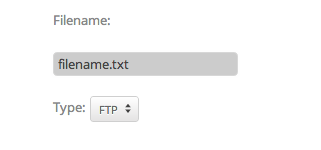

# KDFormView

KDFormView is inerhited from [KDView](/core/KDView). It's handy view to create
custom forms. It is a DOM element of type `<form>`. For a detailed explanation
of a Form Object see [DOM Form
Object](http://www.w3schools.com/jsref/dom_obj_form.asp). Also every KDFormView
has the css class `kdformview` appendend (which you can override via the
options).

You can add custom data(which is an Object of key/value pairs) and a callback
function via the constructor. This will extend the options of the View. You can
retrieve them via the methods:

* getCallback()
* getCustomData() (TODO: re-check again)

The currently supported instance methods are:

* addCustomData(path, value) : add custom data to the path, specified via the
  value(which is an Object of key/value pair). If path is a string then it is
  stored as:

    path, value

  if the path is an (key/value pair) then is is stored as:

    key, value
  
* getCustomData(path): if path is available get it at from the path, otherwise
  return the custom data assigned trough the constructor(see above).
* removeCustomData(path): remove the custom data specified with the location
  `path`
* serializeFormData(data={}) : applies serializeArray to the input data and
  stores the array of objects to the `data` variable. For more info look at
  [JQuery serializeArray](http://api.jquery.com/serializeArray/) documentation.
* getData() : runs serializeFormData on the custom data and returns it.
* getFormData() : get all inputs, together with the custom datas and return it
* focusFirstElement() : focus on the firs input element. It traverse trough all
  child inputs and triggers the "focus" event on the first input element.
* reset() : Resets the form
* submit(): Submits the form. Before submitting, it tests for validation of all
  input elements. After all test it sends the event "FormValidationFinished". If
  all validation rules are passed then the event "FormValidationPassed" is
  emitted, otherwise the form emits the event "FormValidationFailed"

Below is an example to populate a KDFormView:

    :::coffeescript
    @addSubView @form = new KDFormView
      
    @form.addSubView labelFileName = new KDLabelView
      title : "Filename:"

    @form.addSubView @inputFileName = inputFileName = new KDInputView
      label        : labelFileName
      defaultValue : "filename.txt"
    
    @form.addSubView ftpTypeName = new KDLabelView
      title : "Type:"

    @form.addSubView labelFinder = new KDSelectBox
      title : "Select a :"
      selectOptions : [
                  { title : "FTP", value : "ftp" }
                  { title : "SFTP", value : "sftp" }
                  ]

Which get transformed too:

KDFormView has a static method called `findChildInputs` that you can use to
traverse all child inputs (some of the instance methods explained above are
using this static method). This is useful to get the input data from the form
you created. Below is a fully functional app code which uses this static method
to retrieve the value from the `inputFileName` input field.

    :::coffeescript
    class MainView extends KDView
      constructor:->
        super

        @addSubView @form = new KDFormView
          
        @form.addSubView labelFileName = new KDLabelView
          title : "Filename:"

        @form.addSubView @inputFileName = inputFileName = new KDInputView
          label        : labelFileName
          defaultValue : "filename.txt"
        
        @form.addSubView ftpTypeName = new KDLabelView
          title : "Type:"

        @form.addSubView labelFinder = new KDSelectBox
          selectOptions : [
                      { title : "FTP", value : "ftp" }
                      { title : "SFTP", value : "sftp" }
                      ]

        @addSubView @button = new KDButtonView
          title: "Show Form Data"
          callback: =>
            inputs = KDFormView.findChildInputs @
            fileName = inputs[0].getValue()
            new KDNotificationView
              content: "#{fileName}"
              
    appView.addSubView new MainView
      cssClass: "my-koding-app"

There is also handy component (which is based on KDFormView) called 
[KDFormViewWithFields](/framework/forms/KDFormViewWithFields) that let you
create Form Views more easily. I recommended to have look at it.
