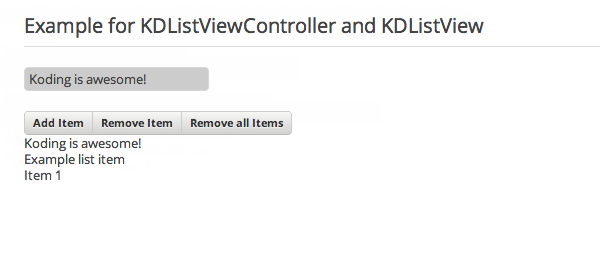
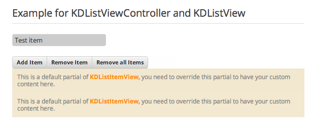

# KDListViewController

KDListViewController is inerhited from
[KDViewController](/core/KDViewController). It let you create easily lists with
custom items. By custom we mean any view that is [KDView](/core/KDView) related.

The constructor takes two arguments:

    :::coffeescript
    constructor:(options = {}, data)

Where options is a object of the following are currently supperted

## options

* **wrapper**: a Boolean. By default it is yes. It sets `options.view` to a new
  KDView class with a css class of name: "listview-wrapper". That means you can use
  getView() (which comes from KDViewController) to get a ready view for your
  list. If you set it to `no`, then the listView is set to `options.view`.
* **scrollView**: Boolean. By default it is yes. The listView is added as a
  subView to a KDScrollView. If you don't want this you can disable it.
* **keyNav**: Boolean. By default it is no.
* **multipleSelection**: Boolean.By default it is no.
* **selection**: Boolean. By default it is yes.
* **startWithLazyLoader**: By default it is no.
* **itemChildClass**     or= null
* **itemChildOptions**   or= {}
* **view**

## helpers

* itemForId:(id)->
* getItemsOrdered:->
* getItemCount:->
* setListView:(listView)->
* getListView:->
* forEachItemByIndex:(ids, callback)->

## modifications

* addItem:(itemData, index, animation)->
* removeItem:(itemInstance, itemData, index)->
* registerItem:(view, index)->
* unregisterItem:(itemInfo)->
* replaceAllItems:(items)->
* removeAllItems:->

## mouseevents

* mouseDownHappenedOnItem:(item, event)->
* mouseUpHappened:(event)->
* mouseEnterHappenedOnItem:(item, event)->

## keyevents

* keyDownPerformed:(mainView, event)->

## item selection

* selectItem:(item, event = {})->
* selectItemBelowOrAbove:(event)->
* selectNextItem:(item, event)->
* selectPrevItem:(item, event)->
* deselectAllItems:()->
* deselectSingleItem:(item)->
* selectSingleItem:(item)->
* selectAllItems:()->
* selectItemsByRange:(item1, item2)->
* itemSelectionPerformed:->
* itemDeselectionPerformed:(deselectedItems)->

## lazy loaders

* showLazyLoader:(emitWhenReached = yes)->
* hideLazyLoader:->

# Example app for KDListViewController and KDListView

Below is an example code:

    :::coffeescript
    @listController = new KDListViewController
      lastToFirst     : yes
      viewOptions     :
        type          : "example-list"
        itemClass     : ExampleLgtistItem

Where ExampleListItem is of type
[KDListItemView](/framework/list/KDListItemView).

KDListViewController is a common component which is used a lot.  Below is an
example app that shows the basic of a KDListViewController and KDListItemView.
The app looks like:

Here you see that we have alreayd added thre items. The code for this app is:

    :::coffeescript
    class MainView extends JView
      constructor:->
        super
        @header = new KDHeaderView
          type: "big"
          title: "Example for KDListViewController and KDListView"

        @listController = new KDListViewController
          lastToFirst     : yes
          viewOptions     :
            type          : "example-list"
            itemClass     : ExampleItemView

        @listView = @listController.getView()

        @buttons = new KDButtonGroupView
          buttons:
            "Add Item"  :
              callback    : =>
                input = @inputView.getValue()
                @listController.addItem input
                @_notify?.destroy()
                @_notify = new KDNotificationView
                  title : "Item added!"
            "Remove Item" :
              callback    : =>
                inputData = @inputView.getValue()
                @listController.removeItem null, inputData, null
                @_notify?.destroy()
                @_notify = new KDNotificationView
                  title : "Item removed!"
            "Remove all Items"  :
              callback    : =>
                @listController.removeAllItems()
                @_notify?.destroy()
                @_notify = new KDNotificationView
                  title : "All items removed"

        @inputView = new KDInputView
          cssClass      : "test-input"
          placeholder   : "Write item name..."

      pistachio:->
        """
        {{> @header}}
        {{> @inputView}}
        {{> @buttons}}
        {{> @listView}}

        """
      viewAppended: ->
        @setTemplate do @pistachio

    class ExampleItemView extends KDListItemView
      constructor: (options, data) ->
        super

      partial: =>
        content = @getData()
        """
        #{content}
        """

    appView.addSubView new MainView
      cssClass: "my-koding-app"

Let me explain the code in detail. The code itself is looks like a lot, however
it's mostly the button and callback part that takes so much space. Anyway as you
see we created a KDListViewController which is the main controller for our
KDListItemView's:

    :::coffeescript
    @listController = new KDListViewController
      lastToFirst     : yes
      viewOptions     :
        type          : "example-list"
        itemClass     : ExampleItemView

As you see we use here `viewOptions` to define our item class. We use our own
item class, named `ExampleItemView`. If we don't define anything then
an empty KDListItemView with no options is applied. You can remove the itemClass
option and compile the app to see the result:

Ok, why is this showing? Because prior of this we were overriding the `partial`
of the KDListItemView. We do these in the line:

    :::coffeescript
    @listController.addItem input

The `@listController.addItem input` line basically creates a new list item based
on the itemClass. The `addItem()` method is described at the beginning of the,
basically here `input` is the first argument. If we ommit any other arguments,
than coffeescript assumes these as `null`. This means the line above is the same
as:

    :::coffeescript
    @listController.addItem input, null, null

Now if we use `ExampleItemView` for the options `itemClass` than the partial is
overrided via our own extended class:

    :::coffeescript
    class ExampleItemView extends KDListItemView
      constructor: (options, data) ->
        super

      partial: =>
        content = @getData()
        """
        #{content}
        """

As you here see, we're getting the data and showing it in the `partial`. We are
overriding `partial. That's it because we use our custom KDListItemView
(`ExampleItemView`) and setting it to `itemClass` in KDListViewController.

Now, there are actually three ways to remove(as explained at the beginning). We
used the second way. The code for this is:

    :::coffeescript
    inputData = @inputView.getValue()
    @listController.removeItem null, inputData, null

Because we didn't give any index number or item instance, we are iterating over
the whole list array until we match `inputData`. This is done automatically via
`removeItem()`. Now this seems very easy, however problems occur when you have
an item that is of complex form. Be careful with that. Another way is to remove
via item instances, like:

    :::coffeescript
    itemView = @listController.getListView()
    @listController.removeItem itemView.items[2], null, null

This will remove the third item instance in the list.
