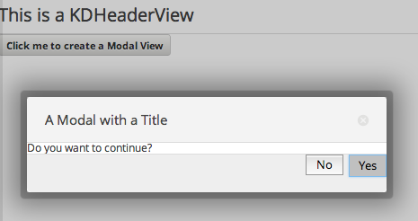

# KDModalView

KDModalView is inerhited from [KDView](/core/KDView). Below is an example code:

    :::coffeescript 
    modal = new KDModalView
        title: "A Modal with a Title"
        content: "Do you want to continue?"
        height: "auto"
        overlay: yes
        buttons:
            Yes:
                loader:
                    color: "#ffffff"
                    diameter: 16
                style: "css-class"
                callback: ->
                    new KDNotificationView
                        title: "Clicked yes!"
                    modal.destroy()
            No:
                loader:
                    color: "#ffffff"
                    diameter: 16
                style: "css-class"
                callback: ->
                    new KDNotificationView
                        title: "Clicked no!"
                    modal.destroy()

A modal view will be created if the button below in the picture is clicked:

