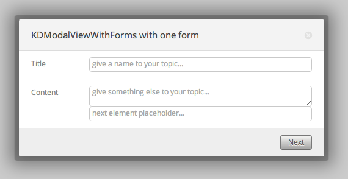
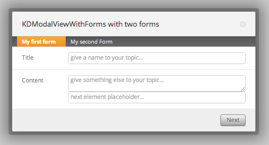

# KDModalViewWithForms

KDModalViewWithForms is inerhited from
[KDModalView](/framework/modals/KDModalView). It's a modal view that has one or
more seperated forms in it. Useful for getting user credentials, setting up
configurations, etc..

It's almost exactly as the KDModalView one, however it has an additional view
added which is of type [KDTabViewWithForms](/framework/tabs/KDTabViewWithForms).
I recommended to read how to configure a proper KDTabViewWithForms before you
continue (it's kinda essential for a KDModalViewWithForms).  This view can be
modifed via the options `tabs`. Below are two examples, with one form and two
forms:

## One form

    :::coffeescript
    modalViewWithForms = new KDModalViewWithForms
     title     : "KDModalViewWithForms with one form"
     content   : ""
     overlay   : yes
     width     : 500
     height    : "auto"
     cssClass  : "new-kdmodal"
     tabs                    :
       navigable             : yes
       forms                 :
         "My first form"     :
           buttons           :
             Next            :
               title         : "Next"
               style         : "modal-clean-gray"
               type          : "submit"
           fields            :
             Hiko            :
               label         : "Title"
               type          : "text"
               name          : "hiko"
               placeholder   : "give a name to your topic..."
               validate      :
                 rules       :
                   required  : yes
                 messages    :
                   required  : "topic name is required!"
             Content         :
               label         : "Content"
               type          : "textarea"
               name          : "content"
               placeholder   : "give something else to your topic..."
               nextElement   :
                 lulu        :
                   type        : "text"
                   name        : "lulu"
                   placeholder : "next element placeholder..."

Which get transformed too:

## Two forms

    :::coffeescript
    modalViewWithForms = new KDModalViewWithForms
      title     : "KDModalViewWithForms with two forms"
      content   : ""
      overlay   : yes
      width     : 500
      height    : "auto"
      cssClass  : "new-kdmodal"
      tabs                    :
        navigable            : no
        forms                 :
          "My first form"     :
            buttons           :
              Next            :
                title         : "Next"
                style         : "modal-clean-gray"
                type          : "submit"
            fields            :
              Hiko            :
                label         : "Title"
                type          : "text"
                name          : "hiko"
                placeholder   : "give a name to your topic..."
                validate      :
                  rules       :
                    required  : yes
                  messages    :
                    required  : "topic name is required!"
              Content         :
                label         : "Content"
                type          : "textarea"
                name          : "content"
                placeholder   : "give something else to your topic..."
                nextElement   :
                  lulu        :
                    type        : "text"
                    name        : "lulu"
                    placeholder : "next element placeholder..."
          "My second Form"    :
            buttons           :
              Submit          :
                title         : "Submit"
                style         : "modal-clean-gray"
                type          : "submit"
              Reset           :
                title         : "Reset"
                style         : "modal-clean-red"
                type          : "reset"
            fields            :
              Places          :
                label         : "Coffee"
                type          : "text"
                name          : "title"
                placeholder   : "give a coffee type"
                validate      :
                  rules       :
                    required  : yes
                  messages    :
                    required  : "topic name is required!"

Which get transformed too:

